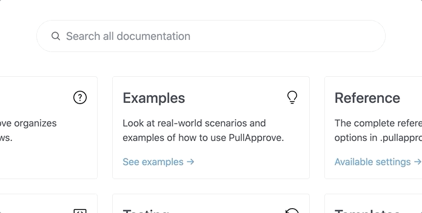

# pitchfork

Pitchfork is a complete, local search solution for static sites. It knows how to index HTML content, uses [Lunr](https://lunrjs.com/) to search it, and [Mustache](https://github.com/janl/mustache.js/) for simple front-end customization.

It's like [Algolia DocSearch](https://docsearch.algolia.com/), but you don't have to rely on an external service.



## Quick install using CDN and npx

Include pitchfork on your website:

```html
<input data-pitchfork-input type="text" placeholder="Search">
<div data-pitchfork-results style="display: none;">
    {{#results}}
    <a href="{{url}}">
        <div>{{{highlights.title}}}</div>
        <div>{{{highlights.text}}}</div>
    </a>
    {{/results}}

    {{^results}}
    <div>No matches, keep typing...</div>
    {{/results}}
</div>

<script src="https://unpkg.com/@dropseed/pitchfork@<1.0.0/dist/search.js"></script>
```

Create an index (without installing pitchfork to your project):

```sh
$ npx -p @dropseed/pitchfork pitchfork index your_html_directory -c .dom_selector_for_main_content
```

## Full install

Pitchfork is on [npm](https://www.npmjs.com/package/@dropseed/pitchfork).

```sh
$ npm install @dropseed/pitchfork
```

Generate your index:

```sh
$ pitchfork index your_html_directory -c .dom_selector_for_main_content
```

```js
require("@dropseed/pitchfork/search")
```

## HTML and templating

This is a more complete example showing all of the `data-pitchfork` options.

```html
<input data-pitchfork-input type="text" placeholder="Search">
<div data-pitchfork-results
    data-pitchfork-index-url="/search-index.json"
    data-pitchfork-truncate="140"
    data-pitchfork-highlight-class="bg-yellow-200"
    data-pitchfork-active-class="bg-gray-100"
    style="display: none;">
    {{#results}}
    <a href="{{url}}" class="block py-2 px-4 border-b border-gray-200 hover:bg-gray-100">
        <div class="font-medium">
            {{{highlights.title}}}
        </div>
        <div class="text-sm text-gray-700">
            {{{highlights.text}}}
        </div>
    </a>
    {{/results}}

    {{^results}}
    <p>No matches, keep typing...</p>
    {{/results}}
</div>
```
